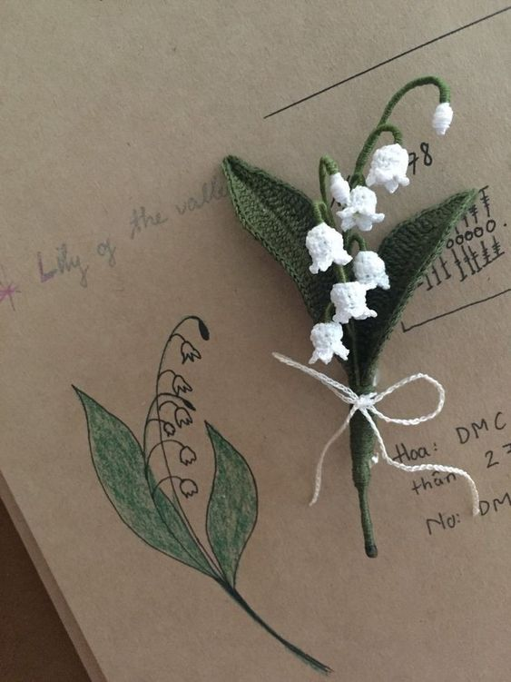

  
  

    <samp>
      my stack
       
      languages: javascript/typescript, html, css
       
      frameworks: react/next.js
       
      databases: mongodb
       
       
      <a href="https://discord.com/users/974025524546531380">@Saige#0934</a> 
      inspired by <a href="https://github.com/jckli">/jckli</a>
       
    </samp>
     
 
  

